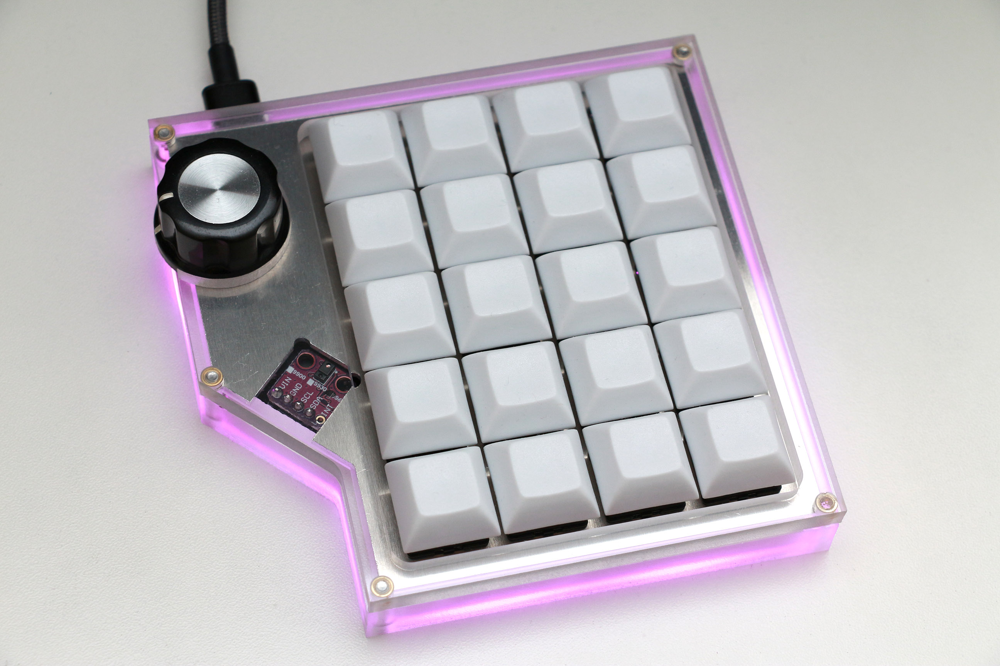

Cherry Blossom Numpad
=====

A custom DIY numpad. See the build process and it in action [here](https://youtu.be/7neqXtf0uJI).

Features:
 - RGB Backlighting with APA102
 - Encoder side wheel with push button
 - Support for 17 or 20 key layouts
 - Gesture sensor (APDS-9960)
 - QMK powered

The APDS-9960 gesture sensor can detect proximity, brightness, color, or gestures. Gestures consist of up, down, left, right, close and far. Using the gesture detection is currently a little finicky because if there is a gesture being performed over the sensor (or really any movement over the sensor) the numpad is unresponsive to all button inputs.

PCB gerbers and schematic are in the `pcb` folder.

A 3D model of the case and plate without the gesture sensor hole is in the model folder called `numpad_nogesture.step`. If you want the hole for the gesture sensor, use the model `numpad_gesture.step`. The body thicknesses are slightly different because they came from different models where I had different material thicknesses set for CNC operations.